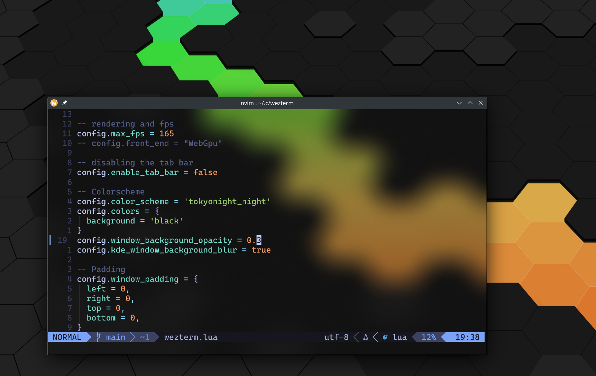

---
tags:
  - appearance
---
# `kde_window_background_blur = false`

When combined with `window_background_opacity`, enables background blur
using the KDE Wayland blur protocol.

This can be used to produce a translucent window effect rather than
a crystal clear transparent window effect.

This effect can be achieved by adding the following to the configuration:

```lua
config.window_background_opacity = 0.4 -- opacity as you please
config.kde_window_background_blur = true
```



See also [win32_system_backdrop](win32_system_backdrop.md) for a similar
effect on Windows.

See also [macos_window_background_blur](macos_window_background_blur.md) for
a similar effect on macOS.
