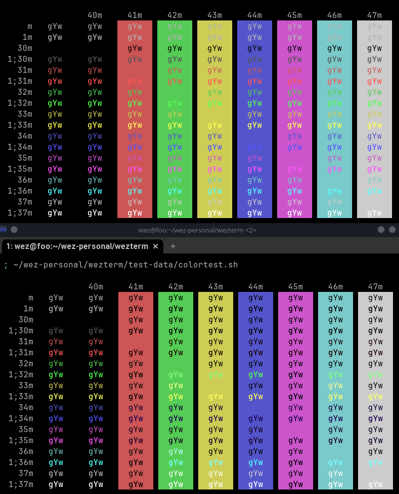

---
tags:
  - appearance
---
# `text_min_contrast_ratio = nil`

{{since('nightly')}}

An optional floating point value that defaults to `nil` (not being set).

When set, it defines the minimum contrast ratio between the foreground
and background color of a textual cell, when the cell has differing
foreground and background colors.

If the color attributes of a cell fall below the minimum contrast ratio, then
the foreground color will have its luminance (perceived brightness) adjusted to
try to boost the contrast ratio to meet the specified minimum.

This may cause the foreground color to either increase or decrease in
luminance, typically making it either more white or more black.

It may not be possible to achieve the requested minimum ratio, in which
case a slightly better or the original color (if no better color can
be computed) will be used.

If the foreground and background colors in a cell are identical, then
that is assumed to be deliberate and the colors will remain unchanged
by this setting.

[WCAG 2.0 level AA](https://www.w3.org/WAI/WCAG2AA-Conformance) requires a
contrast ratio of at least 4.5:1 for normal text, so setting
`text_min_contrast_ratio = 4.5` is a reasonable value if you find that your
selected color scheme has poor contrast in the applications that you run in
your terminal.

In the screeshot below, the upper portion shows the default wezterm color scheme,
while the lower portion shows how it renders with `text_min_contrast_ratio = 4.5`.

